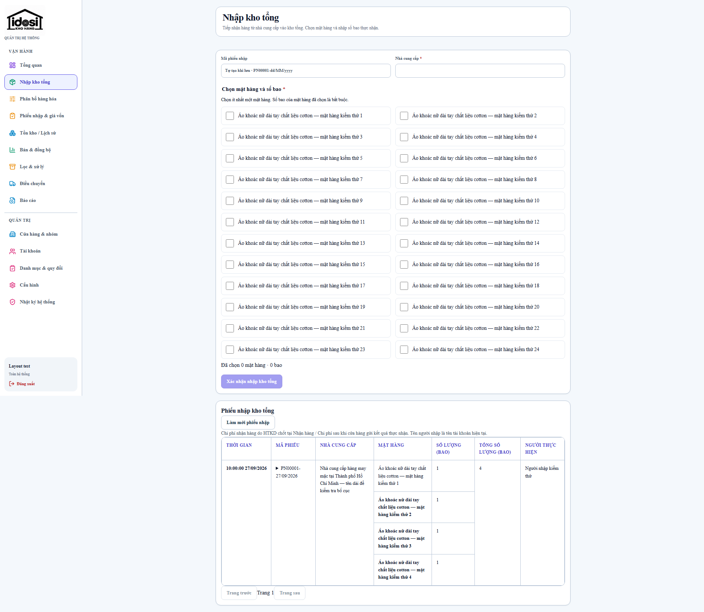
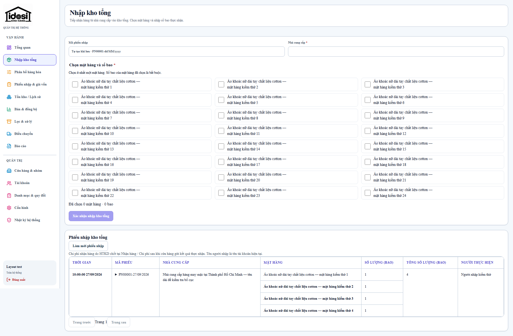
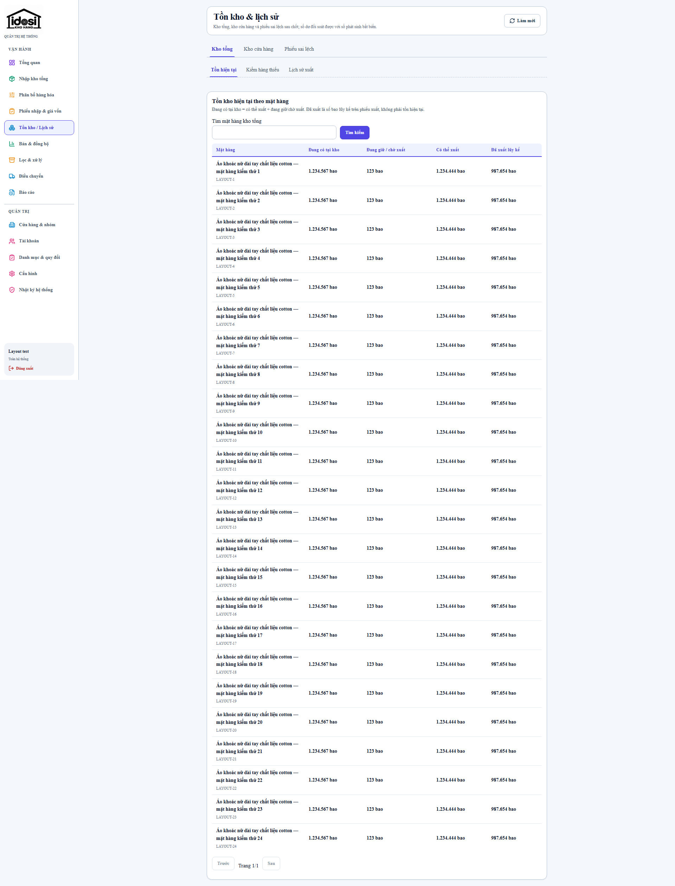
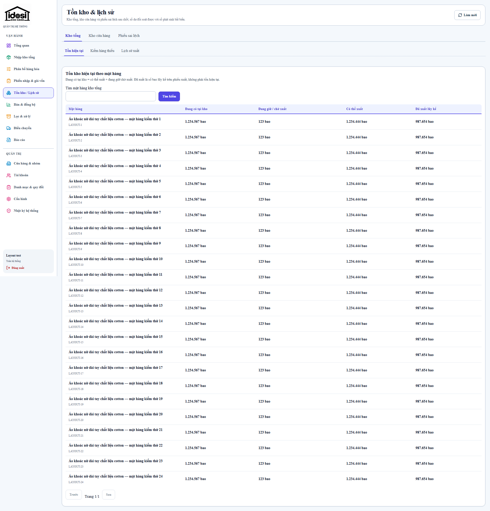
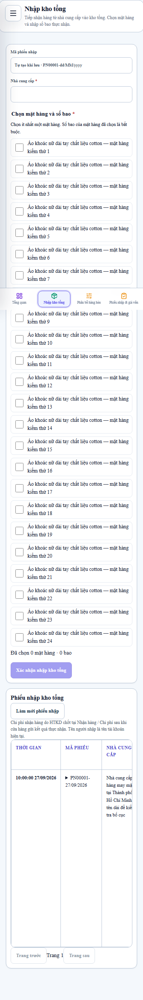
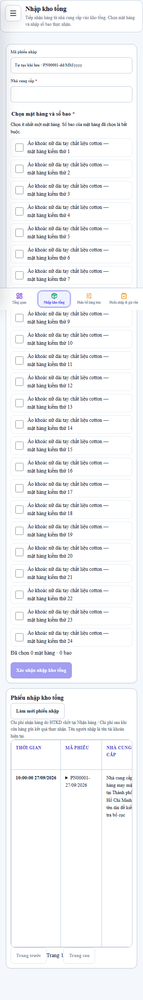
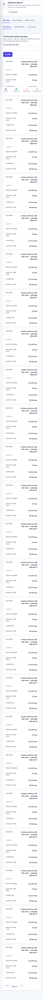

# Desktop fluid workspace verification

Base: `9f7af33c6109039f94bde48dba68d7cba1b00836`. All measurements use CSS pixels, 100% browser zoom, the same 24 long Vietnamese product names, one four-line inbound receipt, large inventory counts, no selected products, identical pagination and closed receipt details. Fixtures are in `apps/web/e2e/layout-fixtures.ts`; no production transactions were created.

## Confirmed cause and changes

- `styles.css .app-main`: percentage-based padding used the containing width before subtracting the 224px sidebar. The resulting content stayed at 968px from 1366px upwards. Fixed 18px gutters now fill the remaining workspace; sidebar/main share one width token. `flow-root` retains margin containment without clipping descendants.
- `warehouse-inventory.css .warehouse-stock-panel` and `warehouse-inbound.css .warehouse-inbound-form`: removed the secondary 1120px caps.
- Inbound product grid adapts to available width with 460px minimum tracks (bounded by 100%); 2/3/4 columns at 1440/1920/2560px. Product labels remain close to quantity controls. Existing 900px document / 520px two-column receipt limits remain intentional and unchanged.
- Removing main clipping exposed the report grid's 260 + 360 + 12px minimum at 821px. It now stacks below 1100px. Mobile full-bleed header margins follow the actual 16/18px gutter, avoiding the old 2px overshoot on either side.
- Other shared grids already use side-by-side desktop layouts and do not require overrides. No JSX, business logic, API, permissions, database, records, fonts or pagination changes.

## Measurements

| Screen             | Viewport    | Gutter each side | Page panel width | Main height | Fully visible rows/cards |
| ------------------ | ----------- | ---------------- | ---------------- | ----------- | ------------------------ |
| /warehouse-inbound | 1366 × 768  | 87px → 18px      | 968 → 1106       | 1670 → 1590 | 16 → 16                  |
| /warehouse-inbound | 1440 × 900  | 124px → 18px     | 968 → 1180       | 1670 → 1590 | 20 → 20                  |
| /warehouse-inbound | 1920 × 1080 | 364px → 18px     | 968 → 1660       | 1670 → 1258 | 24 → 25                  |
| /warehouse-inbound | 2560 × 1440 | 684px → 18px     | 968 → 2300       | 1670 → 1440 | 26 → 28                  |
| /warehouse-inbound | 390 × 844   | 16px → 16px      | 358 → 358        | 2724 → 2724 | 8 → 8                    |
| /inventory         | 1366 × 768  | 87px → 18px      | 968 → 1106       | 2519 → 2519 | 3 → 3                    |
| /inventory         | 1440 × 900  | 124px → 18px     | 968 → 1180       | 2519 → 2519 | 5 → 5                    |
| /inventory         | 1920 × 1080 | 364px → 18px     | 968 → 1660       | 2519 → 1998 | 7 → 10                   |
| /inventory         | 2560 × 1440 | 684px → 18px     | 968 → 2300       | 2519 → 1998 | 12 → 16                  |
| /inventory         | 390 × 844   | 16px → 16px      | 358 → 358        | 9040 → 9040 | 0 → 0                    |

Visible items count product picker cards plus history rows on inbound, and table rows on inventory. The record count stays 28 (24 products + 4 history lines) and 24 respectively. Document height has a viewport-height floor, so 2560×1440 cannot report a page shorter than 1440 even when its content is shorter. Raw measurements include sidebar/main/header/panel rectangles and primary action coordinates in [before.json](evidence/desktop-fluid-layout/before.json) and [after.json](evidence/desktop-fluid-layout/after.json).

At 1920×1080, inbound document height falls 1670 → 1258px (24.7%), inventory 2519 → 1998px (20.7%). Mobile 390×844 retains identical dimensions. Long mobile tables remain scrollable/card-based; the task does not reduce records to manufacture a smaller page.

## Visual evidence

Screenshots were refreshed with animations disabled and the viewport set before navigation so the mobile sidebar is fully closed. The before images replay the three original CSS files from the baseline SHA over the same fixture DOM; their document heights were checked against the original pre-change measurements (1670/2519px desktop and 2724/9040px mobile).

| Screen            | Before                                                                     | After                                                                    |
| ----------------- | -------------------------------------------------------------------------- | ------------------------------------------------------------------------ |
| Inbound desktop   |  |  |
| Inventory desktop |          |          |
| Inbound mobile    |   |   |
| Inventory mobile  |           |           |

## Verification scope

- Production browser layout tests cover 1366×768, 1440×900, 1920×1080, 2560×1440, 1024×768, 768×1024, 360×800, 390×844, 412×915 and widths 819/820/821. Assertions cover sidebar/gutters, panel/header alignment, document overflow and actual clipped rectangles, all records retained, compact selected-product stepper, keyboard reachability, mobile menu and 44px buttons.
- Loading, empty, API error and recovery states are intercepted deterministic fixtures. Existing smoke tests cover modal focus trapping/restoration and compact request controls.
- The shared shell sweep uses the repository's demo role modes across dashboard, warehouse inbound, inventory/history, allocation, requests, receiving, costs, transfers and reports where permitted. This is layout coverage, not proof of server authorization or loaded production data on every route. API/PostgreSQL live workflows separately cover authenticated behavior.
- Actual Microsoft Edge tab zoom verified via a temporary local extension using `chrome.tabs.setZoom`: 125% yields a 1536px CSS viewport and DPR 1.25; 150% yields 1280px and DPR 1.5 from a 1920px browser viewport. Inbound and inventory have no document overflow. See [zoom.json](evidence/desktop-fluid-layout/zoom.json).

## Gates and release

Final command results and CI links are recorded in the pull request. Local PostgreSQL 17 runs in a dedicated Docker container. Initial test setup omitted admin bootstrap; the fixture was corrected before rerunning gates. The Linux migration wrapper uses `spawn('npm')`, which fails on Windows; local migration used the existing `npm run db:migrate` command, while CI verifies the deployment wrapper on Linux.

Rollback: revert the squash commit through a PR and let the existing watcher deploy the resulting green main SHA. No migration or data reversal is needed. Watcher backup, health, readiness, running SHA and post-deploy read-only smoke checks remain required.

## Update 2026-10-01 — tables inside the fluid workspace

The fluid workspace and its 18px gutters are unchanged; no shared `max-width` was reintroduced. Tables no longer stretch to the panel width: each table wrapper is content-sized, centred in its direct container and scrolls horizontally on its own when the table needs more room. See [responsive-table-layout-audit.md](responsive-table-layout-audit.md).

## Update 2026-10-02 — gutters superseded

The 18px desktop gutter above is historical evidence. Current guidance: `--content-gutter` is 54px
(3 × 18px) per side from 1280px and grows linearly 18 → 54px between 821 and 1279px; ≤820px keeps
the 16/18px mobile padding. See [desktop-login-spacing-audit.md](desktop-login-spacing-audit.md).
