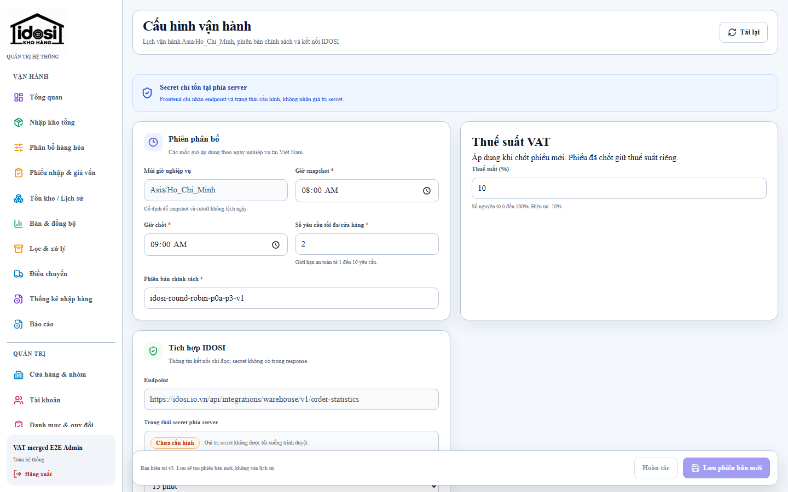
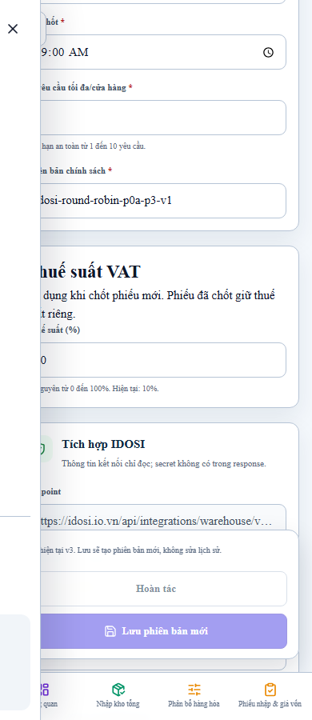
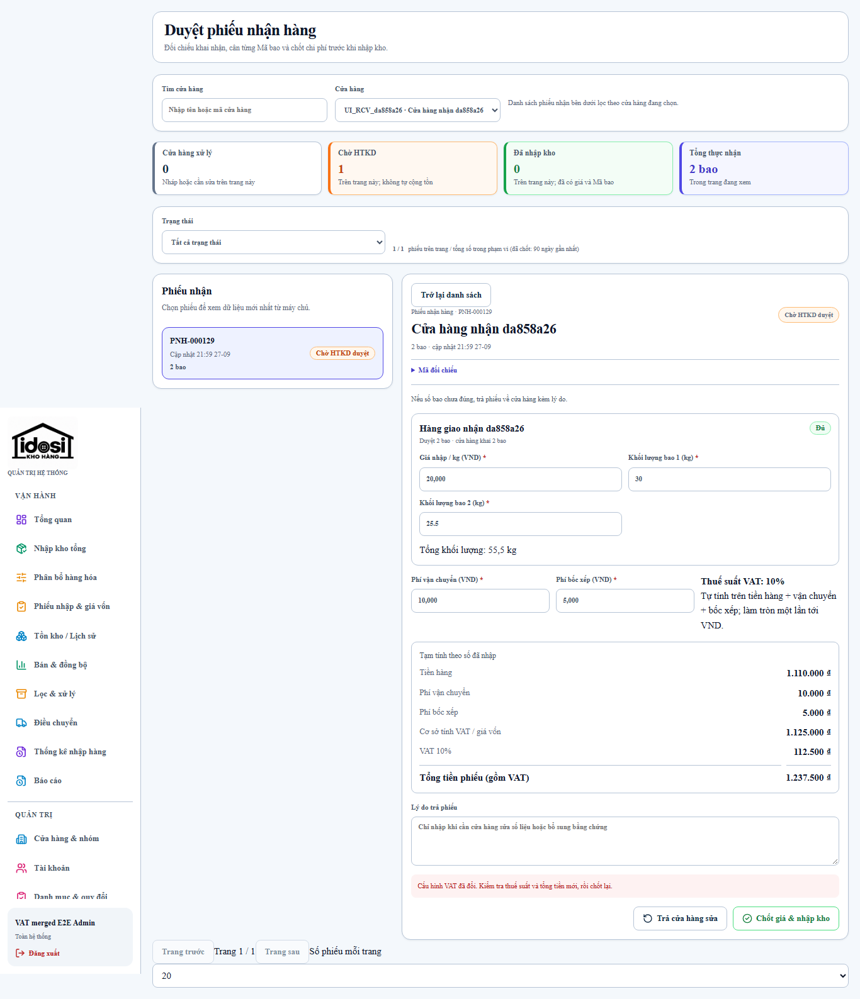
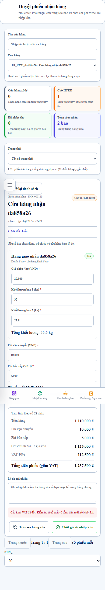
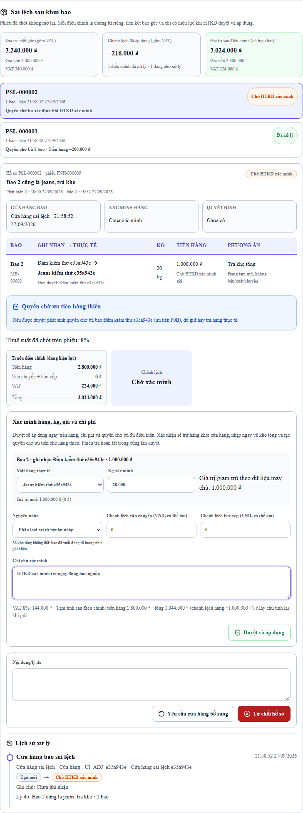
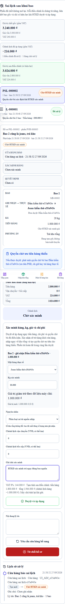
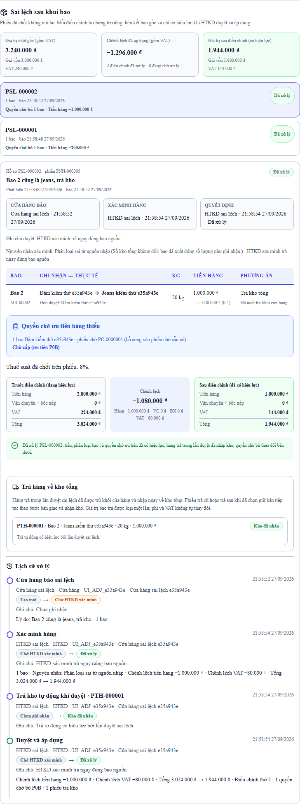
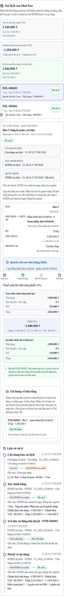

# Kiểm chứng cấu hình VAT và sai lệch phiếu nhận

Base ban đầu: `d13148406a019cca8a58d4639dcb65267a160c22`; đã tích hợp main `0d9e601ae887f384e4e75286789b26d9d56c9996` (#85). Node 24.19, PostgreSQL 17.6 Docker,
database kiểm thử biệt lập. Các ảnh và số liệu dưới đây là test, không phải giao dịch production.

## Kết quả local

- `npm ci --no-audit --no-fund`: thành công.
- `npm run format:check`, `npm run lint`, `npm run typecheck`, `npm run build`: thành công.
- `RUN_POSTGRES_TESTS=1 npm run test`: 854 test đạt: API 84, web 293, worker 31,
  contracts 129, database 240, domain 77; không skip PostgreSQL.
- `npm run e2e`: 26 đạt, 6 skip có chủ đích theo viewport.
- `npm run e2e:production -w @idosi/web`: 10 đạt.
- `npm run e2e:live`: 20/20 đạt trên database mới sau tích hợp main. Trước tích hợp, sau sửa phần tổng hợp chênh lệch
  gồm VAT, chạy lại 3 ca receipt-adjustment/vat-settings: 3/3 đạt.
- Migration runner gốc `node infra/scripts/run-migrations.mjs`: hai lần đạt trong
  Node 24 Linux với dependencies cài riêng; seed hai lần đạt. Windows wrapper gặp
  `spawn npm ENOENT`, đã kiểm chứng bằng runner Linux đúng quy trình CI/deploy.
- Migration 0034 trên schema cũ giữ nguyên VAT thủ công và NULL; FK/constraint mới
  được kiểm tra bằng PostgreSQL. Toàn chuỗi migration trên database mới đạt.
- Test snapshot chạy seed hai lần khi cấu hình 10%, xác nhận vẫn là 10%.
- `npm run db:generate`: không có schema thay đổi sau snapshot 0034.
- `node infra/scripts/check-migration-safety.mjs`: đạt.

Các lượt thử trên database tích lũy vướng phiên ngày cố định và cấu hình quota do E2E cũ
để lại. Lượt nghiệm thu toàn suite dùng database mới như CI; không sửa nghiệp vụ phân bổ
để che lỗi fixture. Các lỗi form Admin chỉ sửa VAT chưa bật nút Lưu và selector lịch sử
trùng đã được sửa và E2E kiểm chứng. Driver pg có cảnh báo query đồng thời trên client,
không làm các suite nghiệm thu thất bại.

## Các invariant được kiểm tra

Thuế suất 0/8/10/100 và half-up, số tiền an toàn; quyền Admin và version conflict;
snapshot không đổi khi sửa cấu hình; form đang mở buộc xem lại VAT; KEEP cập nhật giá;
RETURN không giá/giá giả, trả bao từng được điều chỉnh; hai hồ sơ đồng thời cùng phiếu;
idempotency và replay sau mất phản hồi; rollback đầy đủ khi lỗi; ledger/hold/quyền P0B;
SOURCE_MISCLASSIFICATION và WAREHOUSE_MISPICK; legacy PENDING_ADMIN và phiếu trả cũ;
VAT manual/NULL; báo cáo thuần sau trả.

E2E trên phiếu 3 triệu, VAT 240 nghìn: KEEP giảm giá vốn 200 nghìn, VAT còn 224 nghìn,
tổng còn 3.024.000, chênh lệch tổng −216.000. Sau RETURN thêm bao 1 triệu: giá vốn
1.800.000, VAT 144.000, tổng 1.944.000, chênh lệch cộng dồn −1.296.000.

Không tràn ngang ở 360/390/412/768/1366/1440 px.

## Ảnh giao diện

Trước thay đổi, ảnh RETURN trên baseline có ô giá:
[desktop](../receipt-immediate-return/htkd-return-before-1440.png),
[mobile](../receipt-immediate-return/htkd-return-before-390.png).

Sau thay đổi:

## Phát hành

CI, PR, merge SHA và bằng chứng watcher/post-deploy được cập nhật trong PR và báo cáo
bàn giao sau khi thực hiện. Không suy ra production từ test local. Chính sách migration,
snapshot/legacy và hạn chế rollback nằm trong [tài liệu VAT](../../vat-store-receipt.md).

Migration VAT chuyển từ 0032 sang 0034 khi main phát hành hai migration mới trong #85; chuỗi 0000–0034 đã chạy lặp bằng runner Linux trên database mới. Giữ nguyên trigger nhận thừa và index báo cáo của main, kiểm chứng cả thống kê và VAT trong cùng suite.
