# Căn giữa và co giãn bảng dữ liệu — kiểm kê và bằng chứng (01/10/2026)

Base: `ca3d0c4a207333bd28edbce96ddf278c5248a66f` (HEAD `main` lúc bắt đầu, chưa có commit mới khi tạo nhánh). Nhánh: `fix/responsive-centered-tables`.

## 1. Yêu cầu đã chốt

1. Khối bảng căn giữa trong **vùng chứa trực tiếp** (panel, `
`, phiếu), hai bên bằng nhau (`|gapLeft − gapRight| ≤ 2px`). Vùng làm việc giữ nguyên gutter 18px và không có `max-width` chung.
2. Bảng ít cột/nội dung ngắn rộng bằng nội dung; bảng nhiều cột mở rộng theo nội dung tới hết vùng chứa, sau đó **cuộn ngang cục bộ** từ cột đầu tới cột cuối. Trang không cuộn ngang.
3. Mọi ô dữ liệu căn trái: tiêu đề, chữ, số lượng, kg, tiền, ngày, dòng tổng, ô nhập; nhãn và giá trị trong thẻ mobile cũng căn trái.
4. Không đổi dữ liệu, số bản ghi, quyền, bộ lọc, phân trang, sort, chọn dòng, tổng, công thức hay payload.

## 2. Nguyên nhân đã chứng minh

| Triệu chứng                                    | Nguyên nhân (source)                                                                                                                                                                                                                                                                               |
| ---------------------------------------------- | -------------------------------------------------------------------------------------------------------------------------------------------------------------------------------------------------------------------------------------------------------------------------------------------------- |
| Bảng bám mép trái panel, khoảng trắng bên phải | `.responsive-table { width:100% }`, `.document-history`, `.admin-table-wrap`, `.inbound-table-scroll`, `.bag-opening-history__scroll` là block rộng 100%; `table-density` chỉ đặt bảng `width:auto` nên bảng co lại nhưng nằm sát trái trong wrapper 100%.                                         |
| Bảng ít cột vẫn giãn hết panel                 | `styles.css table { width:100% }` cho mọi bảng không opt-in density (form nhận hàng, điều chỉnh, lịch sử điều chuyển, thống kê IDOSI, nhập đối tác…); `document-history.css` đặt `width/min-width:100%` và `min-width:7rem` mỗi ô; `inbound-statistics.css` đặt `width:100%`.                      |
| Số liệu căn phải                               | `table-density.css` (`.table-number`, `--metrics`), `document-history.css` (`.document-number`), `warehouse-inventory.css` (cột số), `inbound-statistics.css` (mọi ô trừ cột đầu).                                                                                                                 |
| Giá trị mobile căn phải                        | `styles.css @media (max-width:620px)`: `td { text-align:right }`, `td strong, td small { align-items:flex-end }`, `.table-actions { justify-content:flex-end }`, `.allocation-session-actions`, `.session-request-time`; `receipt-adjustments.css` đẩy nút trong ô sang phải (`justify-self:end`). |
| Cột tên tồn kho rộng cố định                   | `warehouse-inventory.css` đặt `width:32rem` cho cột tên ở mọi dữ liệu.                                                                                                                                                                                                                             |

`packages/ui/src/Table.tsx` không có consumer nào trong `apps/web` (39 bảng đều là HTML trực tiếp), nên không sửa API chung này. Không bảng nào nằm trong modal/drawer (`role="dialog"` của Catalog/Waitlist/BagOpening không chứa `<table>`).

## 3. Giải pháp (ba lớp)

- **Vùng làm việc:** không đổi (`.app-main` 18px gutter, không `max-width`).
- **Vùng chứa/cuộn:** một quy tắc dùng chung trong `styles.css` cho năm wrapper hiện có: `width: fit-content; max-width: 100%; min-width: 0; margin-inline: auto; overflow-x: auto`. Wrapper rộng bằng bảng khi vừa, chạm biên thì thành scrollport đủ rộng; auto margin không âm nên nội dung bắt đầu ở cột đầu và cuộn tới cột cuối (không dùng flex centering). Tiền tố `.app-main` giữ ưu tiên trước CSS feature lazy-load.
- **Bảng/cột/ô:** bảng `width:auto` (intrinsic, `table-layout:auto`), không `min-width:100%`, không chia cột đều; ô dữ liệu `text-align:left`. Số giữ `tabular-nums` và không ngắt giữa số. Tên/ghi chú dài xuống dòng trong giới hạn 20–32rem có sẵn.
- **Thẻ mobile:** wrapper chiếm 100% vùng nội dung (gutter đều), giá trị/hành động căn trái, dòng phụ (`<small>`, ví dụ mã SKU) nằm ở cột giá trị thay vì rơi dưới nhãn.
- **Ngoại lệ có chủ đích:** lịch sử khui kiện ≤820px giữ bảng cố định 880px và cuộn ngang như trước (đã có tỷ lệ cột đo cho màn hẹp). Lý do điều chỉnh không còn bị `line-clamp: 2` cắt trong bảng duyệt điều chỉnh (đủ chữ, xuống dòng trong 32rem). Nút/badge vẫn căn giữa nhãn bên trong nút.
- Không đổi JSX, query, API, quyền, payload, database, migration, worker. Không thêm JavaScript đo độ rộng.

## 4. Kiểm kê bảng

39 vị trí `<table>` trong 25 file. Cột “Wrapper/CSS” là quy tắc đang áp dụng sau thay đổi; “Đo live” là state đã đo có dữ liệu thật trong `e2e-live/responsive-table-layout.spec.ts` (tài khoản tạo trong DB test). “Không có dòng” = route mở được nhưng state đo không có bản ghi; layout đã đo nhưng chưa chứng minh mật độ dòng.

| #     | Route / state (vai trò)                                    | Bảng                                         | Component                               | Wrapper / CSS                                       | API                                              | Đo live                                  |
| ----- | ---------------------------------------------------------- | -------------------------------------------- | --------------------------------------- | --------------------------------------------------- | ------------------------------------------------ | ---------------------------------------- |
| 1     | `/` (ADMIN, HTKD, STORE, WHOLESALE)                        | Sức khỏe cửa hàng                            | `DashboardPage.tsx:817`                 | `.responsive-table` + density                       | dashboard snapshot (`/store-receipt-summaries`…) | Có dữ liệu, 5 identity                   |
| 2–3   | `/` (WHOLESALE)                                            | Tổng quan sỉ: mặt hàng / cửa hàng sỉ         | `WholesaleOverview.tsx:188,231`         | `.responsive-table` + density                       | `/order-requests`, `/store-receipts`             | Có dữ liệu                               |
| 4     | `/allocations` (ADMIN, HTKD, STORE, WHOLESALE)             | Yêu cầu và kết quả                           | `AllocationPage.tsx:213`                | `.responsive-table`                                 | `/order-requests`                                | Có dữ liệu                               |
| 5     | `/allocations` (ADMIN, HTKD)                               | Phiên nhận đơn và phân bổ                    | `AllocationPage.tsx:1008`               | `.responsive-table` + density                       | `/order-sessions`                                | Có dữ liệu                               |
| 6–7   | `/allocations` › `
` phiếu tổng hợp / kết quả      | Phiếu đặt tổng hợp, phiếu kết quả            | `AllocationPage.tsx:1308,1336`          | `.document-history` + density metrics               | `/session-documents`                             | Có dữ liệu (details mở)                  |
| 8     | `/requests` (HTKD, STORE, WHOLESALE; ADMIN qua URL)        | Lịch sử đặt hàng                             | `RequestsPage.tsx:680`                  | `.document-history` + density                       | `/order-requests`                                | Không có dòng trong state đo             |
| 9     | `/warehouse-inbound` (ADMIN, HTKD)                         | Lịch sử nhập kho tổng (rowSpan)              | `WarehouseInboundPage.tsx:231`          | `.document-history--compact`                        | `/inbound-receipts`                              | Có dữ liệu + fixture 4 dòng              |
| 10    | `/receive`, `/costs` › chọn phiếu                          | Dòng nhận hàng (ô nhập)                      | `ReceivePage.tsx:1372`                  | `.responsive-table.receipt-lines-table`             | `/store-receipts/:id`                            | Có dữ liệu (HTKD, STORE)                 |
| 11    | `/receive`, `/costs` › phiếu đã chốt                       | Dòng phiếu chỉ đọc                           | `ReceivePage.tsx:1899`                  | `.responsive-table.receipt-lines-table`             | `/store-receipts/:id`                            | Đọc source; state chốt không có trong DB |
| 12    | `/receive`, `/costs` › điều chỉnh phiếu đã chốt            | Dòng điều chỉnh thiếu/thừa                   | `ReceiptAdjustments.tsx:790`            | `.responsive-table.adjustment-lines`                | `/receipt-adjustments/:id`                       | Đọc source + e2e-live receipt-adjustment |
| 13    | `/inventory` › Phiếu sai lệch (ADMIN)                      | Hàng đợi điều chỉnh                          | `AdminAdjustmentWorkspace.tsx:370`      | `.responsive-table` + density                       | `/receipt-adjustments`                           | Có dữ liệu (tab đo live)                 |
| 14    | `/receive`, `/allocations` › hàng giữ                      | Hàng ưu tiên đang giữ                        | `HeldAllocationsPanel.tsx:85`           | `.responsive-table` + density                       | `/held-allocations`                              | Có dữ liệu ở `/allocations`              |
| 15    | `/partner-inbound` (HTKD, STORE bán lẻ)                    | Phiếu nhập đối tác                           | `PartnerInboundPage.tsx:445`            | `.responsive-table`                                 | `/store-partner-inbounds`                        | Có dữ liệu (STORE) / rỗng (HTKD)         |
| 16    | `/inventory` › Kho tổng › Tồn hiện tại                     | Tồn kho tổng                                 | `WarehouseInventory.tsx:130`            | `.responsive-table` + `.warehouse-stock-table`      | `/warehouse-inventory`                           | Có dữ liệu + fixture 24 dòng             |
| 17    | `/inventory` › Kho tổng › Lịch sử xuất                     | Phiếu chờ xuất & lịch sử xuất                | `WarehouseInventory.tsx:201`            | `.responsive-table` + density                       | `/outbound-requests`                             | Tab con, đọc source                      |
| 18    | `/inventory` › Kiểm hàng thiếu                             | Hàng thiếu chờ xác nhận                      | `ShortageChecksPanel.tsx:97`            | `.responsive-table` + density                       | `/warehouse-shortage-checks`                     | Tab con, đọc source                      |
| 19    | `/inventory` › Kho cửa hàng (ADMIN, HTKD, STORE)           | Bao tồn cửa hàng                             | `InventoryOperations.tsx:650`           | `.responsive-table` + density                       | `/store-inventory-bags`                          | Có dữ liệu, 116 dòng                     |
| 20    | `/inventory` › Sổ phát sinh                                | Chứng từ nguồn                               | `InventoryOperations.tsx:1518`          | `.responsive-table`                                 | `/store-inventory-bags/:id/ledger`               | Mở khi chọn bao, đọc source              |
| 21    | `/sales` (ADMIN, HTKD, STORE)                              | Hàng Sale còn lại                            | `InventoryOperations.tsx:1951`          | `.responsive-table` + density                       | `/store-sorted-stocks`                           | Có dữ liệu                               |
| 22    | `/sorting` (ADMIN, HTKD, STORE)                            | Lịch sử lọc (cột Cửa hàng động)              | `InventoryOperations.tsx:2168`          | `.responsive-table` + density                       | `/store-sorting-history`                         | Có dữ liệu                               |
| 23    | `/open-bag` (ADMIN, HTKD, STORE)                           | Lịch sử khui kiện                            | `BagOpeningHistoryTable.tsx:58`         | `.bag-opening-history__scroll` + density            | `/store-bag-openings`                            | Có dữ liệu                               |
| 24    | `/transfers` (ADMIN, HTKD, STORE)                          | Điều chuyển trước đây                        | `TransferOperations.tsx:409`            | `.document-history`                                 | `/store-transfers`                               | Có dữ liệu                               |
| 25    | `/transfers` › hàng Sale                                   | Lịch sử điều chuyển Sale                     | `SortedSaleTransferWorkspace.tsx:419`   | `.document-history.sale-transfer-history` + density | `/sorted-sale-transfers`                         | Có dữ liệu                               |
| 26    | `/` và màn bán hàng IDOSI › tổng hợp                       | Tổng hợp theo sản phẩm                       | `IdosiSalesSummary.tsx:305`             | `.responsive-table` + density metrics               | IDOSI order statistics                           | Có dữ liệu                               |
| 27–28 | Màn bán hàng IDOSI › `
` / sản phẩm                | Theo ngày/ca, sản phẩm trong snapshot        | `IdosiStatisticsPanel.tsx:414,473`      | `.responsive-table`                                 | IDOSI statistics summary                         | Đọc source; e2e-live idosi-period        |
| 29–31 | `/inbound-statistics` (ADMIN)                              | Loại cửa hàng / cửa hàng / mặt hàng (11 cột) | `InboundStatisticsPage.tsx:428,463,534` | `.inbound-table-scroll` + density                   | `/reports/inbound-statistics`                    | Có dữ liệu, 3 bảng                       |
| 32    | `/reports` (ADMIN, HTKD)                                   | Báo cáo tháng theo mặt hàng                  | `ReportsPage.tsx:626`                   | `.responsive-table` + density metrics               | `/reports/monthly`                               | Có dữ liệu (ADMIN)                       |
| 33    | `/catalog` (ADMIN, HTKD)                                   | Danh mục & quy đổi                           | `CatalogPage.tsx:708`                   | `.responsive-table` + density                       | `/products`, `/product-conversions`              | Có dữ liệu                               |
| 34–35 | `/stores` (ADMIN)                                          | Nhóm cửa hàng / cửa hàng                     | `AdminStoresPage.tsx:955,1032`          | `.admin-table-wrap` + density                       | `/store-groups`, `/stores`                       | Có dữ liệu                               |
| 36    | `/users` (ADMIN)                                           | Tài khoản                                    | `AdminUsersPage.tsx:535`                | `.admin-table-wrap` + density                       | `/admin/accounts`                                | Có dữ liệu                               |
| 37–38 | Chế độ demo (`mockModeEnabled`) của `/inventory`, `/sales` | Nhật ký tồn / quy đổi demo                   | `OperationsPages.tsx:79,262`            | `.responsive-table`                                 | dữ liệu demo tĩnh                                | Không render ở production                |
| 39    | Không render trong UI (chỉ unit test)                      | Mặt hàng trong phiếu nhập                    | `InboundReceiptDetails.tsx:45`          | `.inbound-receipt__products` (không đổi)            | —                                                | N/A                                      |

`/settings` và `/audit` không có `<table>`: cấu hình và nhật ký là danh sách flex/grid; các khối khóa–giá trị này (cài đặt, tóm tắt thống kê IDOSI, thẻ lịch sử yêu cầu, tổng tiền phiếu) không phải cột bảng nên giữ bố cục hiện tại. Login/404 không có bảng; CSS global của chúng không đổi.

## 5. Số đo

Đo bằng `e2e/table-layout-metrics.ts`: `getBoundingClientRect()` của khối bảng nhìn thấy (bảng khi vừa, scrollport khi cuộn) so với content box của vùng chứa trực tiếp; `document.documentElement.scrollWidth ≤ clientWidth + 1`; computed `text-align` của mọi `th/td` và descendant flex/`text-align` bị đẩy sang phải; cuộn scrollport tới hai đầu để kiểm tra cột đầu/cột cuối; so sánh text của các bảng có dòng giữa 12 viewport.

### Live API + PostgreSQL (cùng DB test, cùng tài khoản)

Cùng DB PostgreSQL test (sau khi toàn bộ `e2e:live` đã tạo dữ liệu), cùng 5 tài khoản (spec dùng lại tài khoản của chính nó bằng reset mật khẩu), cùng 57 state × 12 viewport = 684 lần đo. “Trước” là CSS của `ca3d0c4`, “sau” là nhánh này.

| Chỉ số (684 lần đo, 39 state có dòng dữ liệu)  | Trước | Sau |
| ---------------------------------------------- | ----: | --: |
| Bảng lệch tâm (`\|gapLeft − gapRight\| > 2px`) |   682 |   0 |
| Bảng có ô/descendant căn phải                  |   894 |   0 |
| Trang tràn ngang                               |     0 |   0 |
| Cột đầu/cột cuối không cuộn tới được           |     0 |   0 |
| Text bảng khác nhau giữa các viewport          |     0 |   0 |

Đại diện ở 1920×1080 (độ rộng khối bảng nhìn thấy; gap = trái/phải tới content box vùng chứa):

| Vai trò / route / state           | Bảng (cột × dòng)                | Trước: rộng, gap trái/phải | Sau: rộng, gap trái/phải |
| --------------------------------- | -------------------------------- | -------------------------- | ------------------------ |
| ADMIN `/inventory` Kho tổng       | Tồn kho tổng (5 × 20)            | 950.9, 0 / 679.1           | 816.5, 406.7 / 406.8     |
| ADMIN `/inventory` Kho cửa hàng   | Tồn theo mã bao (6 × 482)        | 1036.3, 0 / 593.7          | 1036.3, 296.9 / 296.9    |
| ADMIN `/inventory` Phiếu sai lệch | Danh sách phiếu sai lệch (8 × 9) | 1185.7, 0 / 440.3          | 1185.7, 220.2 / 220.2    |
| HTKD `/receive` chọn phiếu        | Chi tiết phiếu nhận (4 × 1)      | 1039.9, 0 / 0 (giãn 100%)  | 406.8, 316.5 / 316.6     |
| ADMIN `/allocations`              | Phiên nhận đơn (7 × 18)          | 902.1, 0 / 727.9           | 913.3, 358.4 / 358.4     |
| ADMIN `/allocations` › details    | Chứng từ phiên (2 × 1)           | 236.9, 1 / 1362.1          | 220.5, 689.7 / 689.7     |
| ADMIN `/warehouse-inbound`        | Lịch sử nhập (7 × 13, rowSpan)   | 1095.5, 1 / 533.5          | 1095.5, 267.3 / 267.3    |
| ADMIN `/transfers`                | Điều chuyển Sale (11 × 14)       | 1386.2, 1 / 242.8          | 1363.2, 133.4 / 133.4    |
| ADMIN `/inbound-statistics`       | Bảng cửa hàng (11 × 20)          | 1618, 0 / 0                | 1618, 0 / 0 (vừa khít)   |
| ADMIN `/inbound-statistics`       | Loại cửa hàng (7 × 3)            | 820.4, 0 / 797.6           | 820.4, 398.8 / 398.8     |
| ADMIN `/stores`                   | Nhóm (4 × 20)                    | 665, 1 / 952               | 665, 476.5 / 476.5       |
| ADMIN `/users`                    | Tài khoản (5 × 20)               | 1240.7, 1 / 376.3          | 1240.7, 188.6 / 188.6    |
| ADMIN `/catalog`                  | Danh mục (6 × 246)               | 1298.2, 0 / 331.8          | 1298.2, 165.9 / 165.9    |
| ADMIN `/reports`                  | Báo cáo tháng (6 × 82)           | 1035.7, 0 / 594.3          | 1035.7, 297.1 / 297.1    |
| WHOLESALE `/`                     | Mặt hàng / đặt / nhận (3 × 9)    | 491.8, 0 / 1138.2          | 491.8, 569.1 / 569.1     |

Bảng ít cột giữ nguyên độ rộng khi viewport tăng (ví dụ tổng hợp bán hàng 5 cột: 750.3px ở 1440, 1920 và 2560; gap 199.8 → 439.8 → 759.8 mỗi bên). Ở 390px, bảng dạng thẻ rộng đúng vùng nội dung (gap 0/0); lịch sử nhập, khui kiện, điều chuyển giữ dạng bảng và cuộn ngang trong vùng của nó (`overflowing: true`, cột cuối tới được). Dữ liệu thô: [live-before.json](evidence/responsive-table-layout/live-before.json), [live-after.json](evidence/responsive-table-layout/live-after.json).

### Primitive tổng hợp (cột tăng dần, fixture xác định)

`e2e/responsive-table-layout.spec.ts` gắn một bảng dùng đúng wrapper `.responsive-table` vào panel thật của `/inventory` (1440×900) rồi tăng số cột; ngân sách chốt trước khi sửa: bảng ngắn bằng độ rộng max-content của chính nó (±1px) ở mọi độ rộng desktop, và thêm cột không bao giờ làm bảng hẹp lại.

- Bảng 3 cột: 233px ở 1440, 1920 và 2560 (max-content 233px). Trên CSS cũ cùng test lệch 941.9px vì bảng bị kéo 100%.
- 2 → 14 cột: 163 → 1083px, không cuộn. 16–34 cột: bảng đạt vùng chứa 1150px, các ô có khoảng trắng xuống dòng. Từ 36 cột: scrollport giữ 1150px, bảng 1198–1330px, cuộn cục bộ, cột cuối tới được, trang không tràn.
- Bàn phím: vùng “Lịch sử nhập kho tổng” (390px) nhận focus, `End`/`ArrowRight` cuộn tới cột cuối.
- Thứ tự CSS lazy: vào `/inventory` trực tiếp và đi qua Nhập kho tổng rồi quay lại (cả menu mobile) cho số đo giống hệt.
- Zoom trình duyệt thật (`chrome.tabs.setZoom`, Chromium): 100/125/150% ⇒ viewport CSS 1920/1536/1280, DPR 1/1.25/1.5; tồn kho gap 391.2/199.4/71.6 mỗi bên, lịch sử nhập 93.7/0.8/0.7; không tràn trang, không vi phạm. Dữ liệu: [synthetic-growth.json](evidence/responsive-table-layout/synthetic-growth.json), [real-zoom.json](evidence/responsive-table-layout/real-zoom.json).

### Ảnh trước/sau

| Màn hình                | Trước                                                                                    | Sau                                                                                     |
| ----------------------- | ---------------------------------------------------------------------------------------- | --------------------------------------------------------------------------------------- |
| Tồn kho tổng 1920       | 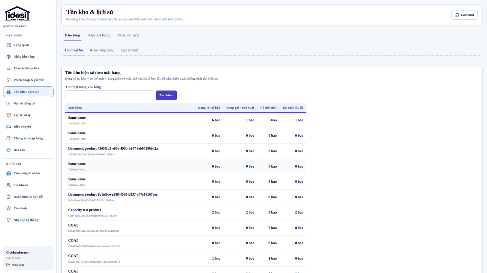            | 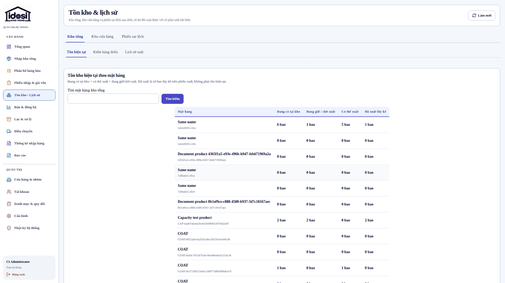            |
| Cửa hàng & nhóm 1920    | 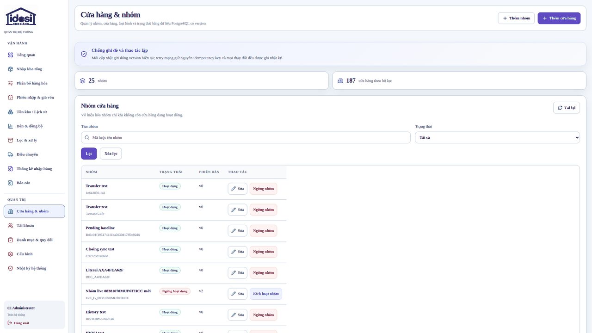               | 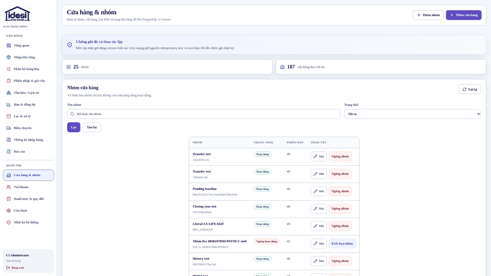               |
| Nhận hàng (HTKD) 1920   | 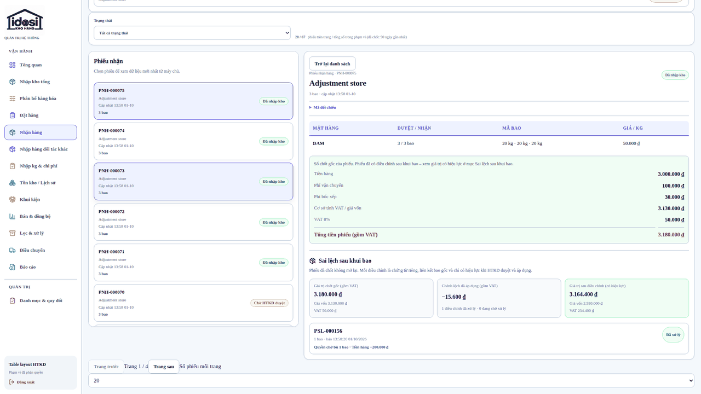 | 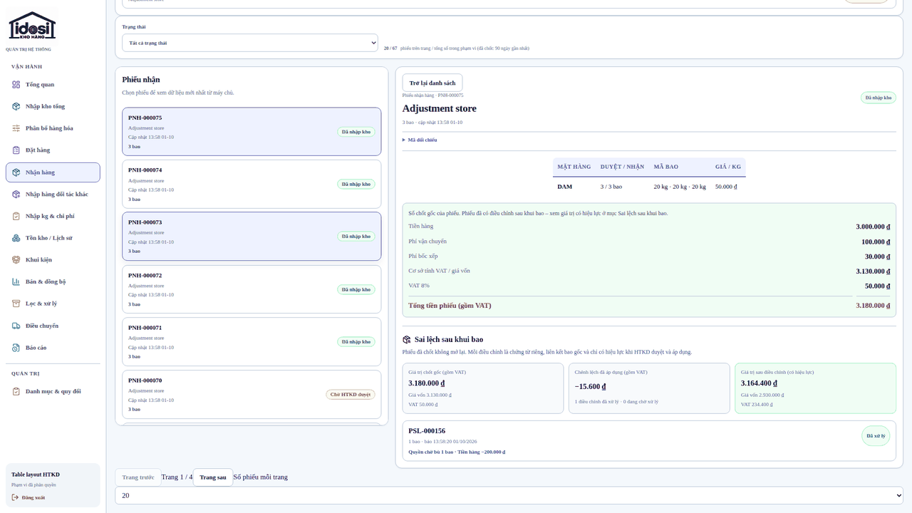 |
| Tổng quan khách sỉ 1920 | 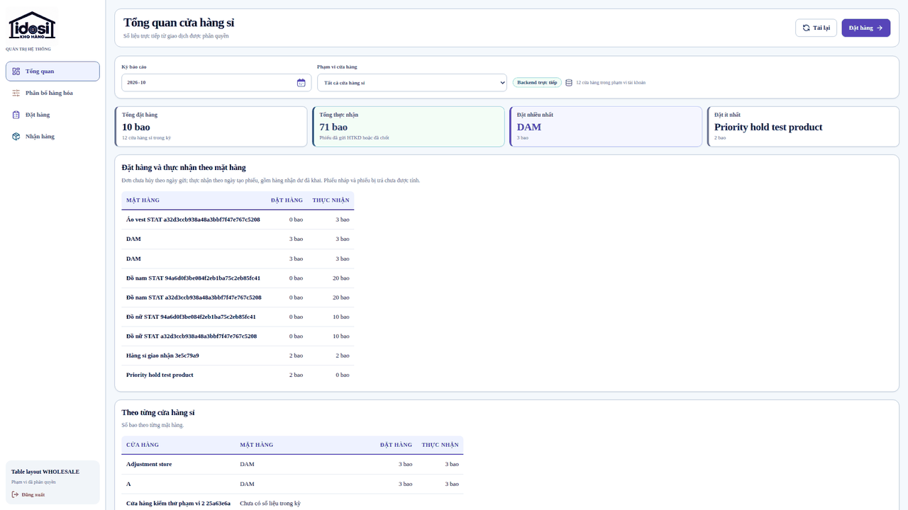                 | 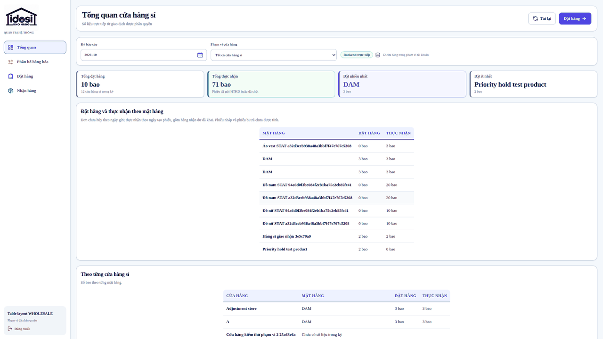                 |
| Tồn kho tổng 390 (thẻ)  | 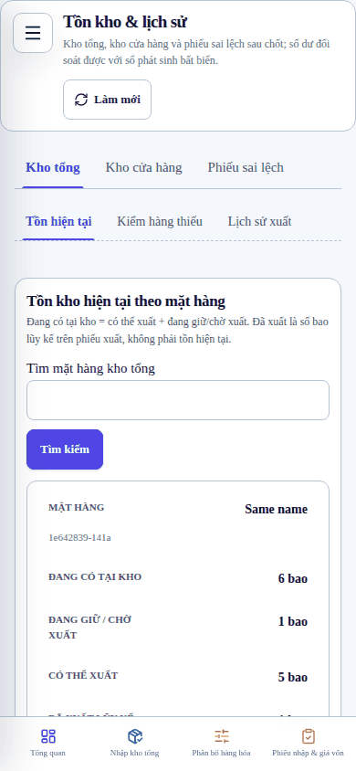             | 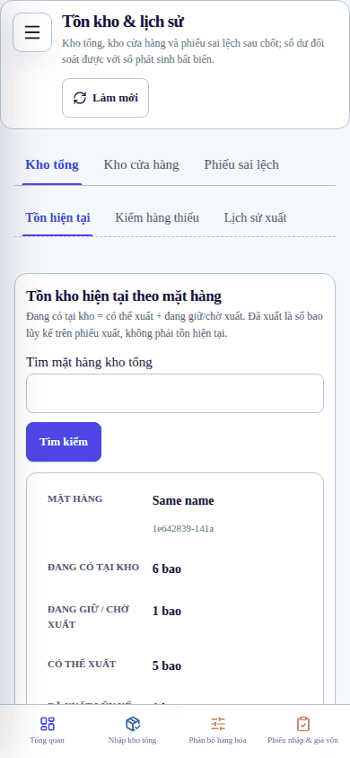             |
| Lọc & xử lý 390         | 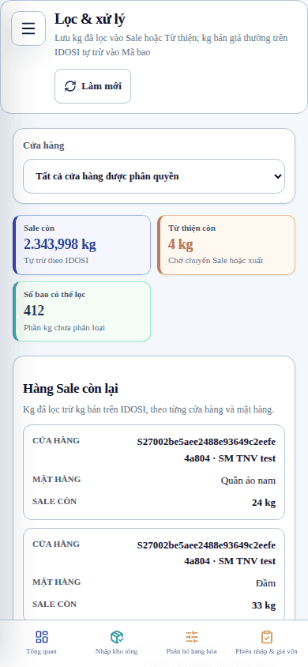               | 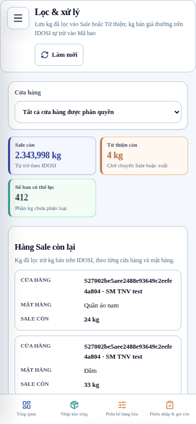               |

Ảnh 1920 thu nhỏ còn 2/3 và giảm màu để giữ dung lượng repository; ảnh chụp viewport (không full page).

## 6. Kiểm thử

Chạy cục bộ theo đúng thứ tự `.github/workflows/ci.yml` trên database mới (Linux, Node 24.21.0, PostgreSQL 16.13 cục bộ, Chromium headless của Playwright 1.63). Kết quả CI GitHub ghi trong PR.

| Lệnh / suite                                                   | Môi trường                                      | Kết quả                                |
| -------------------------------------------------------------- | ----------------------------------------------- | -------------------------------------- |
| `npm run format:check`, `npm run lint`, `npm run typecheck`    | Local                                           | PASS                                   |
| `npm run build`                                                | Local                                           | PASS                                   |
| `run-migrations.mjs` ×2, `seed:production` ×2, bootstrap admin | Local PostgreSQL 16 (DB mới)                    | PASS (không có migration mới)          |
| `npm run test` (`RUN_POSTGRES_TESTS=1`)                        | Local PostgreSQL 16                             | PASS — tất cả workspace (web 313 test) |
| `npm run e2e`                                                  | Local, build e2e có mock fallback               | PASS 33, SKIP 11 (skip theo project)   |
| `npm run e2e:production -w @idosi/web`                         | Local production build `:4175`, API intercept   | PASS 25, SKIP 3 (skip theo project)    |
| `npm run e2e:live`                                             | Local API `:3100` + web `:4174` + PostgreSQL 16 | PASS 25 (gồm spec bố cục bảng mới)     |
| `e2e-live/responsive-table-layout.spec.ts` trước/sau           | Cùng DB, CSS `ca3d0c4` vs nhánh                 | Trước: FAIL (1576 vi phạm); sau: PASS  |
| `e2e/responsive-table-layout.spec.ts` trên CSS cũ              | Local production build                          | FAIL 7/8 như dự kiến (tái hiện)        |

`--list`: `e2e` 44 test/8 file, `e2e:production` 28 test/6 file, `e2e:live` 25 test/21 file. `e2e:production` là production build chạy local, không phải website trên VPS; `e2e:live` chỉ chạy trên DB test cô lập.

## 7. Giới hạn và rủi ro còn lại

- Đo live dùng PostgreSQL 16 cục bộ (không có Docker daemon trong môi trường làm việc); CI GitHub dùng PostgreSQL 17.6. Gate trên CI là bằng chứng chính.
- Zoom thật dùng `chrome.tabs.setZoom` trong `desktop-zoom.spec.ts` (Chromium, 100/125/150%) cho tồn kho và lịch sử nhập; các route còn lại được phủ bằng viewport CSS tương đương (1536/1280px nằm giữa 1440 và 1366/1024 đã đo). Mobile zoom là N/A.
- Một số state chưa có dữ liệu trong DB test (hàng giữ ưu tiên, phiếu nhận đã chốt chỉ đọc, sổ phát sinh theo bao, các tab con của Kho tổng): đã đọc source, dùng chung wrapper/CSS đã đo, nhưng chưa có số đo riêng.
- Quy tắc căn giữa phụ thuộc năm lớp wrapper. Bảng mới phải dùng một trong các wrapper này (hoặc thêm vào danh sách trong `styles.css`); spec live sẽ báo vi phạm nếu bảng mới không căn giữa.

## 8. Rollback

Revert squash commit qua PR, để watcher triển khai SHA mới khi CI xanh. Không có migration, không đổi dữ liệu/API nên không cần khôi phục DB.
