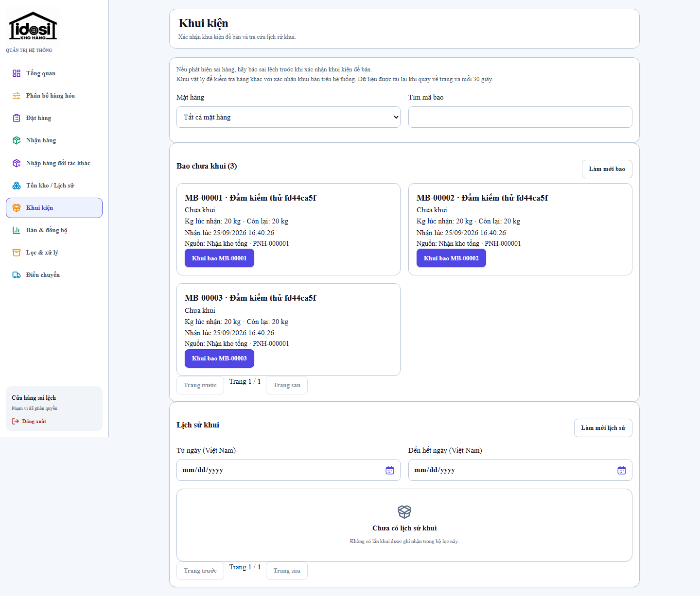
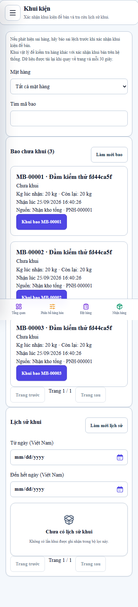
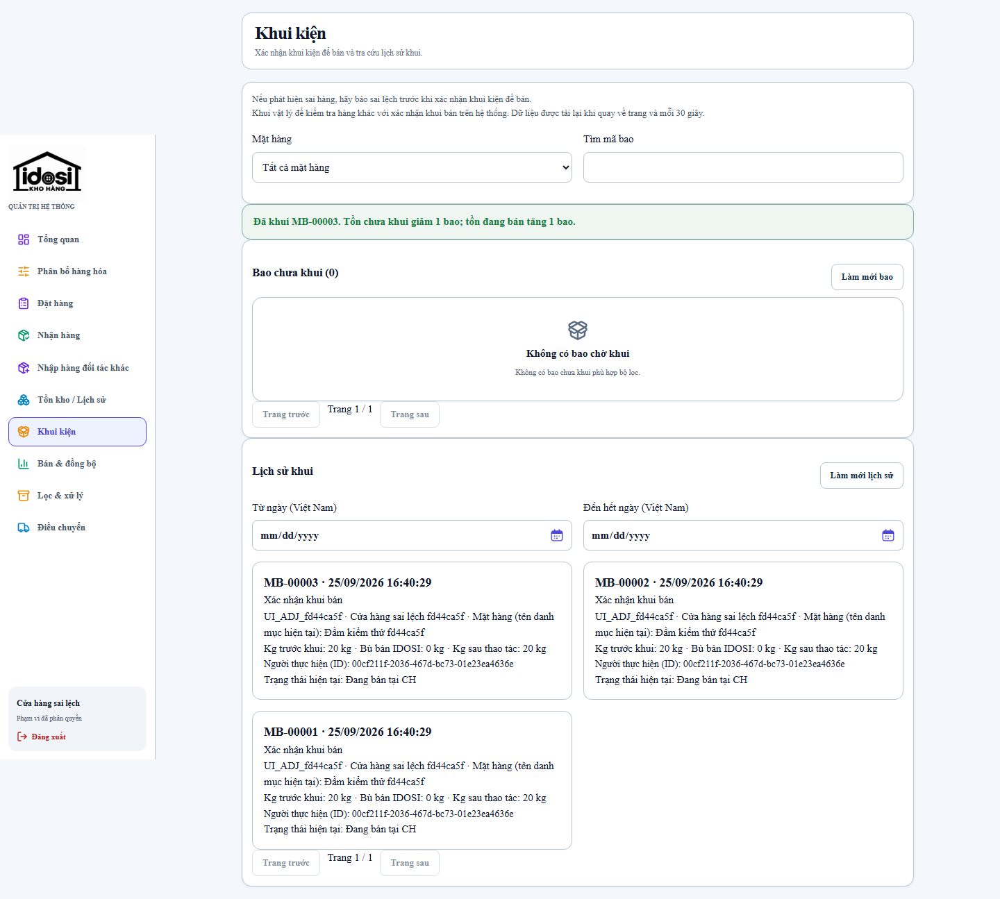
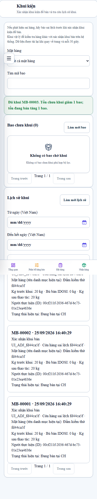

# Kiểm chứng khóa báo sai lệch sau khui bán

Ngày kiểm chứng: 25/09/2026. Baseline: `25f9efdc56701e9c166addab2bd15d7998a33b36`.
Môi trường: Node 24.19, PostgreSQL 17.6 trong Docker, database test riêng; không seed production.

## Kết quả local

- `npm run quality` với `RUN_POSTGRES_TESTS=1`: đạt. API 77, web 241, worker 31, contracts 109, database 189, domain 65 tests; không skip test PostgreSQL.
- `npm run e2e`: 16 đạt, 6 skip theo cấu hình viewport có sẵn.
- `npm run e2e:production -w @idosi/web`: 4 đạt.
- `npm run e2e:live`: 15/15 đạt trên database mới `idosi_live_final`, production build, mock fallback tắt.
- Runner migration gốc `node infra/scripts/run-migrations.mjs` chạy hai lần thành công trong Node 24 Linux; seed hai lần thành công. Windows không chạy trực tiếp runner này vì `spawn npm ENOENT`, nên kiểm chứng môi trường Linux đúng với deploy.
- Hai commit implementation được checkout riêng và `npm run build` độc lập thành công.

Regression bao gồm: opened còn nguyên kg; timestamp/null legacy; bằng chứng audit; hồ sơ nhiều bao rollback cả header/line/hold/audit/idempotency; own quarantine; legacy RESUBMIT/VERIFY/APPLY bị chặn nhưng CANCEL/REJECT vẫn giải phóng; replay và hai request khui cùng version; hai race có barrier PostgreSQL, mỗi thứ tự thắng đúng một command; IDOSI trừ một phần/toàn bộ; snapshot lịch sử không đổi khi product/status đổi; scope STORE/HTKD/ADMIN và WHOLESALE không được đọc lịch sử bán lẻ.

E2E mới mở form báo ở tab A, khui ở tab B, kiểm tra 409, giữ nội dung nhập và khóa lựa chọn cũ; khui hết ba bao và xác nhận lịch sử vẫn có đủ ba dòng. Kiểm tra không tràn ngang tại 360/390/412/768/1366/1440 px.

Các lượt thất bại đã chẩn đoán: selector mới nhầm `heading` với `strong` đã sửa; E2E cũ chạy lại trên database tích lũy vướng giới hạn dropdown 100 cửa hàng và ngày phân bổ cố định trùng. Lượt nghiệm thu cuối dùng database mới đúng vòng đời CI. Không sửa nghiệp vụ ngoài phạm vi để che các lỗi fixture này. Driver pg hiện có cảnh báo query đồng thời trên cùng transaction client; không có test thất bại do cảnh báo.

## Query plan

Projection dùng audit/ledger và index hiện có, không thêm migration/bảng/cờ trùng. Context dependencies chuyển từ truy vấn từng bao sang năm batch aggregates. Trang Khui kiện chỉ tải một trang 20 bao và một trang lịch sử; các màn cũ vẫn giữ helper tải tất cả trang.

`EXPLAIN (ANALYZE, BUFFERS, FORMAT JSON)` trên fixture 10.000 bao, 5.000 audit khui: trang 20 dòng admin 247,333 ms, scope cửa hàng 46,631 ms. Đây là một lần đo local, không phải p95 production; không khẳng định tăng tốc dựa trên số liệu này. Fixture được tạo trong transaction rồi rollback. [Execution plans](evidence/unopened-bags/opening-query-plans-representative.json).

## Ảnh production build với dữ liệu test

## Deploy và rollback

Chỉ watcher deploy merged SHA sau CI xanh. Trước merge, VPS đang chạy baseline; database/container healthy, backup checksum và `pg_restore --list` đạt. Watcher tạo backup mới trước migration của mỗi release. Không có migration mới; rollback ảnh tương thích schema nhưng khôi phục invariant cũ cho báo sau khui, nên ưu tiên forward-fix. CI, merged SHA, backup của release và kết quả post-deploy được ghi trong PR/báo cáo bàn giao sau khi thực hiện, không suy ra từ kết quả local.
